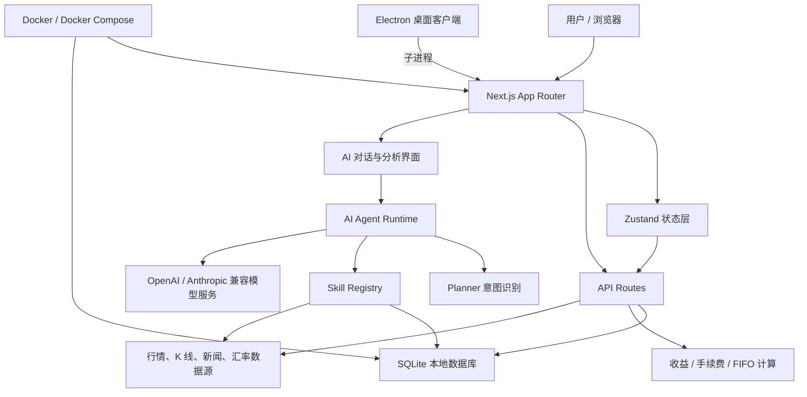

# StockTracker

[](./README.md)
[](./README_en.md)

[](./LICENSE)


StockTracker 是一个本地优先的个人投资记录、组合核算和 AI 投研工作台。

它帮助你记录交易、核算真实持仓成本、跟踪行情和收益，并让 AI Agent 基于你的真实持仓、交易记录和公开市场数据做克制的投研分析。数据默认保存在本机 SQLite，不需要账号，不默认上传到云端。

[快速开始](#快速开始) · [桌面客户端](#桌面客户端-) · [Docker 运行](#docker-运行) · [核心能力](#核心能力) · [AI Agent](#ai-agent) · [文档](#文档) · [免责声明](#免责声明)

## 截图与演示

> 以下截图使用脱敏 demo 数据生成，不包含真实持仓或交易记录。

| 组合总览 | 持仓列表 |
| --- | --- |
|  |  |

| 个股详情 | AI 对话 |
| --- | --- |
|  |  |

## 为什么做它 💡

大多数投资工具擅长展示价格，但不回答持仓核算的具体问题：真实成本是多少、手续费和分红怎么算进去。

StockTracker 的重点是把这些问题算清楚：基于 FIFO 核算每笔卖出的真实盈亏，持仓成本含手续费摊薄；AI Agent 按需读取你的真实持仓批次和交易记录做分析，而不是泛泛聊股票。数据默认存在本机 SQLite，不需要账号，不上传到云端。

## 适合与不适合 🎯

StockTracker 适合：

- 想自己记录股票、ETF、基金或加密资产交易的个人投资者。
- 关心 FIFO、手续费、分红和真实成本核算的人。
- 希望数据默认留在本机，并能自行备份和迁移的人。
- 想把 AI 用在自己的持仓和交易复盘上，而不是泛泛聊天的人。
- 愿意 self-host，并接受第三方行情接口偶尔波动的人。

StockTracker 不适合：

- 高频交易、自动下单或券商账户同步。
- 多用户云端协作、跨设备实时同步或团队后台。
- 对行情实时性和准确性有严格合规要求的生产交易终端。
- 想获得确定性投资建议、收益承诺或自动买卖指令的场景。

## 核心能力 ✨

### 组合与收益核算 📊

- 本地 SQLite 持久化，默认不依赖云端账号。
- 支持 A 股（含 ETF）、港股、美股、基金、加密资产的统一记录模型。
- 支持买入、卖出、分红和加密资产收益记录。
- 固定基于 FIFO 计算卖出盈亏明细，并按券商摊薄口径计算当前持仓成本、浮动盈亏和总盈亏。
- 按市场自动计算手续费，支持用户配置费率。

### 行情、估值与图表 📈

- 聚合腾讯财经、Nasdaq、Yahoo Finance、Stooq、Alpha Vantage 等股票行情源。
- 加密资产报价和 K 线优先使用 Binance，失败回退 Coinbase。
- 支持 K 线、技术指标、估值字段、新闻和大盘概览。
- 内置汇率服务，支持多币种持仓统一折算。
- 多数据源自动降级，最终兜底到 Manual 手动输入模式。

### AI 投研工作流 🤖

- 内置 AI 对话、组合分析、个股分析和大盘分析。
- AI Agent Runtime 按需调用 Skill，不把全部持仓粗暴塞进上下文。
- 交易复盘内置事实账本、成本收益、仓位风险、行情位置和行为纪律等分析框架，并可解释道氏理论、趋势跟随、均值回归等常见方法论。
- 支持未持仓标的查询，自动解析名称、代码和市场并抓取外部行情。
- 支持公开网页搜索和受控网页抓取，用于新闻、公告、财报和大盘事件补充。
- 提供受控的 AI Agent Trace 调试视图，方便排查意图识别和 Skill 调用链路。

### 自部署与工程化 🧰

- 使用 pnpm，项目会阻止 npm/yarn 安装以保持 lockfile 一致。
- 支持 Electron 桌面客户端（macOS / Windows），下载安装即用。
- 支持 Docker / Docker Compose 本地运行。
- 支持中文 / 英文 UI 切换，语言偏好保存在浏览器本地。
- 支持 OpenAI-compatible 和 Anthropic-compatible 模型服务。
- 提供服务端结构化日志和外部接口 smoke test，便于排查上游接口变化。

## 快速开始 🚀

环境要求：

- Node.js 18+
- pnpm
- macOS / Linux / Windows

```bash
git clone https://github.com/byte92/stocktracker.git
cd stocktracker
pnpm install
pnpm dev
```

启动后访问：

- [http://localhost:3218](http://localhost:3218)

`pnpm dev` 默认使用 `3218`，如果端口被占用会自动向后查找可用端口，并在终端输出实际地址。建议启动后先完成 AI 模型配置，以启用对话、组合分析、标的分析和大盘分析等核心体验。

更多开发、环境变量、数据库和测试说明见 [开发指南](./docs/DEVELOPMENT.md)。

## 桌面客户端 🖥️

不需要命令行或 Docker 环境，下载安装即可使用。

### 下载安装

前往 [GitHub Releases](https://github.com/byte92/stocktracker/releases) 下载对应平台的安装包：

| 平台 | 格式 | 安装方式 |
| --- | --- | --- |
| macOS | `.dmg` | 双击打开，拖拽到 Applications |
| Windows | `.exe` | 运行安装向导 |

首次打开会引导配置 AI 服务（可跳过），数据保存在本地，不需要账号。

### 本地构建

如需从源码构建桌面客户端：

```bash
# macOS
pnpm electron:build:mac

# Windows
pnpm electron:build:win
```

构建产物在 `dist-electron/` 目录下。

开发模式调试：

```bash
# 先构建 Next.js standalone
pnpm build

# 启动 Electron 开发模式
pnpm electron:dev
```

更多说明见 [Electron 桌面客户端设计](./docs/superpowers/specs/2026-05-29-electron-desktop-client-design.md)。

## AI 模型配置 🔑

StockTracker 的核心体验依赖 AI 对话和分析能力，建议把模型连接信息放在 `.env.local`：

```bash
cp .env.example .env.local
```

常用变量：

```bash
AI_PROVIDER=openai-compatible
AI_BASE_URL=https://api.openai.com/v1
AI_MODEL=gpt-4.1-mini
AI_API_KEY=sk-...
```

如果 `.env.local` 中的 AI 配置完整，服务端会优先使用环境变量；设置页中的连接配置会作为本地兜底。Temperature、Max Context Tokens、新闻增强和 AI 分析语言仍由设置页控制。

## Docker 运行 🐳

如果你只想把它作为本地服务跑起来，可以直接使用 Docker Compose：

```bash
git clone https://github.com/byte92/stocktracker.git
cd stocktracker/docker
docker compose up -d --build
```

启动后访问：

- [http://localhost:3218](http://localhost:3218)

如需修改宿主机端口，可把 `docker/.env.example` 复制为 `docker/.env` 并修改 `HOST_PORT`。AI 模型配置仍放在根目录 `.env.local`；Docker Compose 会读取 `.env.local` 并注入容器。没有 `docker/.env` 时端口默认使用 `3218`。

容器默认把 SQLite 数据保存在 `docker/data/finance.sqlite` 中，重启不会丢失。更多说明见 [Docker 部署指南](./docker/README.md)。

## AI Agent 🤖

StockTracker 的 AI 不是通用聊天机器人，而是围绕个人持仓和股票数据工作的投研 Agent。

```text
用户问题
  -> Planner 识别意图、市场和需要的数据
  -> security.resolve 解析名称、代码和候选标的
  -> Skill Registry 选择本地持仓、行情、技术指标、网页搜索等能力
  -> Executor 按需读取数据
  -> Context Composer 组装最小必要上下文
  -> LLM 流式生成回复
```

当用户询问个股新闻、公告、利好利空，或 A 股大盘今日政策、盘面新闻时，Agent 会按需调用公开网页搜索。搜索结果会作为带标题、链接、摘要和搜索时间的候选来源进入回答上下文。

## 技术栈 🧱

- Next.js App Router + React + TypeScript
- Electron（桌面客户端）
- Zustand
- SQLite + better-sqlite3
- Tailwind CSS
- lightweight-charts / Recharts
- Playwright
- pnpm
- Docker / Docker Compose

## 整体架构 🧭



## 文档 📚

- [开发指南](./docs/DEVELOPMENT.md)
- [Docker 部署指南](./docker/README.md)
- [项目目录结构](./docs/PROJECT_STRUCTURE.md)
- [Agent 架构设计](./docs/AGENT_ARCHITECTURE.md)
- [行情获取说明](./docs/PRICE_FETCHING.md)

## 参与贡献 🤝

欢迎提交 Issue、改进文档、补充测试、优化 UI、修复行情源、扩展 Skill 或完善 Agent Runtime。

提交 PR 前请阅读 [CONTRIBUTING.md](./CONTRIBUTING.md)。

## 免责声明 ⚠️

StockTracker 提供的是交易记录、数据整理和辅助分析工具，不构成任何投资建议。行情、估值、新闻和 AI 输出可能存在延迟、遗漏或错误。请独立判断风险，并对自己的投资决策负责。

## License

[MIT](./LICENSE)
