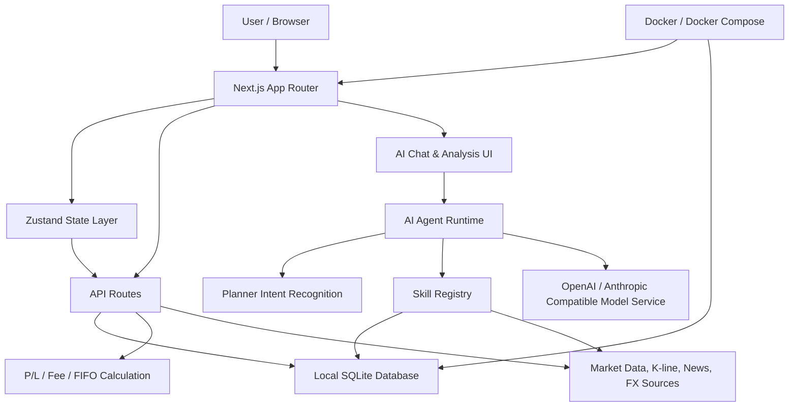

# StockTracker

[](./README_en.md)
[](./README.md)

[](./LICENSE)


StockTracker is a local-first personal investment tracker, portfolio accounting tool, and AI research workspace.

It helps you record trades, calculate real cost basis, track market data and returns, and use an AI Agent to analyze your actual holdings, trades, and public market context. Your data is stored locally in SQLite by default, with no account system and no cloud upload by default.

[Quick Start](#quick-start) · [Docker](#docker) · [Core Features](#core-features) · [AI Agent](#ai-agent) · [Documentation](#documentation) · [Disclaimer](#disclaimer)

## Screenshots and Demo

> Screenshots are generated with sanitized demo data and do not include real holdings or trade records.

| Portfolio Overview | Holdings |
| --- | --- |
|  |  |

| Stock Detail | AI Chat |
| --- | --- |
|  |  |

| AI Analysis History |
| --- |
|  |

## Why StockTracker 💡

Many investment tools are good at showing prices, but struggle to answer questions that matter for personal decision-making:

- What is my real cost basis for this stock?
- After dividends, fees, and sold lots, how should my return be calculated?
- Should today's P/L move on a market-closed day?
- Where is the biggest risk in my current portfolio?
- Which holdings are dragging returns, and which are worth monitoring?
- Can AI analyze my actual trade records instead of giving generic commentary?

StockTracker brings trade records, return calculation, market data, and AI analysis into an interpretable, auditable, self-hostable local workstation.

## Who It Is For 🎯

StockTracker is a good fit if you:

- Track your own stocks, ETFs, funds, or crypto assets.
- Care about FIFO, fees, dividends, income, and real cost basis.
- Want your data to stay local by default, with explicit backup and migration.
- Want AI to work with your holdings and trade review instead of generic chat.
- Are comfortable self-hosting and accepting occasional third-party data-source instability.

StockTracker is not designed for:

- High-frequency trading, auto-ordering, or broker account syncing.
- Multi-user cloud collaboration, real-time cross-device sync, or team back offices.
- Production trading terminals with strict market-data compliance requirements.
- Guaranteed investment advice, return promises, or automatic buy/sell instructions.

## Core Features ✨

### Portfolio Accounting 📊

- Local SQLite persistence, with no cloud account required by default.
- Unified record model for A-shares including ETFs, HK stocks, US stocks, funds, and crypto assets.
- Buy, sell, dividend, and crypto income records.
- FIFO-based sell P/L details, with broker-style diluted cost basis for current holding cost, unrealized P/L, and total P/L.
- Market-specific automatic fee calculation with user-configurable rates.
- Daily P/L only uses valid same-trading-day quotes, so closed markets or stale quotes are not counted as today's movement.

### Market Data and Charts 📈

- Aggregates stock quotes from Tencent Finance, Nasdaq, Yahoo Finance, Stooq, Alpha Vantage, and more.
- Crypto quotes and candles prefer Binance and fall back to Coinbase.
- K-line charts, technical indicators, valuation fields, news, and market overview.
- Built-in exchange-rate service for unified multi-currency portfolio conversion.
- Multi-source fallback with Manual input mode as the final safety net.

### AI Research Workflow 🤖

- Built-in AI chat, portfolio analysis, stock analysis, market analysis, and analysis history.
- AI Agent Runtime calls Skills on demand instead of stuffing all holdings into every prompt.
- Supports non-holding assets by resolving name, symbol, and market, then fetching external quote data.
- Public web search and controlled web fetch for news, announcements, earnings, and market events.
- Controlled AI Agent Trace view for inspecting intent recognition and Skill call chains.

### Self-hosting and Engineering 🧰

- pnpm-only dependency workflow to keep the lockfile deterministic.
- Docker / Docker Compose support for local self-hosting.
- Chinese / English UI switching, with preference stored locally in the browser.
- OpenAI-compatible and Anthropic-compatible model providers.
- Structured server logs and external API smoke tests for diagnosing upstream changes.

## Quick Start 🚀

Requirements:

- Node.js 18+
- pnpm
- macOS / Linux / Windows

```bash
git clone https://github.com/byte92/finance_sys.git
cd finance_sys
pnpm install
pnpm dev
```

After starting, visit:

- [http://localhost:3218](http://localhost:3218)

`pnpm dev` uses `3218` by default; if that port is occupied, it automatically finds the next available port and prints the actual URL. After starting, configure an AI model to unlock the core chat, portfolio analysis, stock analysis, and market analysis experience.

For development, environment variables, database, and testing details, see the [Development Guide](./docs/DEVELOPMENT.md).

## AI Model Configuration 🔑

StockTracker's core experience depends on AI chat and analysis. Put model connection settings in `.env.local`:

```bash
cp .env.example .env.local
```

Common variables:

```bash
AI_PROVIDER=openai-compatible
AI_BASE_URL=https://api.openai.com/v1
AI_MODEL=gpt-4.1-mini
AI_API_KEY=sk-...
```

If `.env.local` contains a complete AI configuration, the server uses it first. The settings page connection fields remain local fallbacks. Temperature, Max Context Tokens, news enhancement, and AI analysis language are still controlled from the settings page.

## Docker 🐳

If you just want to run StockTracker as a local service, use Docker Compose:

```bash
git clone https://github.com/byte92/finance_sys.git
cd finance_sys/docker
docker compose up -d --build
```

After starting, visit:

- [http://localhost:3218](http://localhost:3218)

For custom host ports, copy `docker/.env.example` to `docker/.env` and set `HOST_PORT`. For AI features, copy the root `.env.example` to `.env.local` and fill in your model configuration; Docker Compose optionally injects `.env.local` into the container. Without `docker/.env`, the host port defaults to `3218`.

SQLite data is stored in a Docker volume by default, so it persists across container restarts. For more details, see the [Docker Deployment Guide](./docker/README.md).

## Local-first and Privacy Boundary 🔒

StockTracker stores trades, configuration, AI history, and Agent Trace records in a local SQLite file by default:

```text
data/finance.sqlite
```

The project currently has no cloud account system and does not upload your trade records by default. AI API keys should be placed in `.env.local`, read server-side, and excluded from JSON backups.

Things to note:

- Data does not sync automatically when you switch machines.
- If you delete the local database, the project cannot recover it from the cloud.
- Regular JSON export backups are recommended.
- AI analysis sends necessary holding context to your configured model provider.

## AI Agent 🤖

StockTracker's AI is not a generic chatbot. It is an investment research Agent built around your personal holdings and stock data.

```text
User question
  -> Planner identifies intent, market, and required data
  -> security.resolve resolves names, symbols, and candidate assets
  -> Skill Registry selects local holdings, quotes, technical indicators, web search, and other capabilities
  -> Executor reads data on demand
  -> Context Composer assembles the minimum necessary context
  -> LLM streams the response
```

When users ask about stock news, announcements, bullish/bearish events, or today's A-share policies and market events, the Agent can call public web search on demand. Search results enter the answer context with title, URL, summary, and searched time.

The app UI language can be switched at the bottom of the sidebar. AI analysis output language is still controlled separately by the Analysis Language setting.

## Tech Stack 🧱

- Next.js App Router + React + TypeScript
- Zustand
- SQLite + better-sqlite3
- Tailwind CSS
- lightweight-charts / Recharts
- Playwright
- pnpm
- Docker / Docker Compose

## Architecture 🧭



## Project Structure

```text
app/          Next.js App Router pages and API Routes
components/   React components and business UI
config/       Default configuration
docs/         Architecture, API, and maintenance documentation
hooks/        React hooks
lib/          Domain logic, data sources, AI/Agent, SQLite, i18n, logging
skills/       Agent Skill Markdown descriptions
store/        Zustand state management
tests/        Unit tests and external API smoke tests
types/        Shared types
docker/       Dockerfile, Compose, and deployment docs
```

For detailed boundaries, see [Project Structure](./docs/PROJECT_STRUCTURE.md).

## Documentation 📚

- [Development Guide](./docs/DEVELOPMENT.md)
- [Docker Deployment Guide](./docker/README.md)
- [Project Structure](./docs/PROJECT_STRUCTURE.md)
- [Internationalization](./docs/I18N.md)
- [Data API Inventory](./docs/DATA_API_INVENTORY.md)
- [Agent Architecture](./docs/AGENT_ARCHITECTURE.md)
- [Skill Standard](./docs/SKILL_STANDARD.md)
- [AI Chat Requirements](./docs/AI_CHAT_REQUIREMENTS.md)
- [Price Fetching](./docs/PRICE_FETCHING.md)
- [Open Source Checklist](./docs/OPEN_SOURCE_CHECKLIST.md)

## Contributing 🤝

Issues, documentation improvements, test coverage, UI enhancements, data-source fixes, Skill extensions, and Agent Runtime improvements are all welcome.

Please read [CONTRIBUTING.md](./CONTRIBUTING.md) before submitting a PR.

Common verification commands:

```bash
pnpm test
pnpm build
```

Real external API checks:

```bash
pnpm test:external
```

## Roadmap 🗺️

- Clearer Agent Skill plugin loading mechanism.
- Stronger portfolio risk attribution and trade review capabilities.
- More complete data-source health checks and governance.
- More robust AI Trace, context management, and diagnostic export.
- Docker Hub image publishing and smoother one-click deployment.
- Better open-source collaboration standards, screenshots, demos, and sample data.

## Disclaimer ⚠️

StockTracker provides trade recording, data organization, and analysis assistance tools. It does not constitute investment advice. Market data, valuations, news, and AI output may contain delays, omissions, or errors. Please make independent risk judgments and take responsibility for your own investment decisions.

## License

[MIT](./LICENSE)
