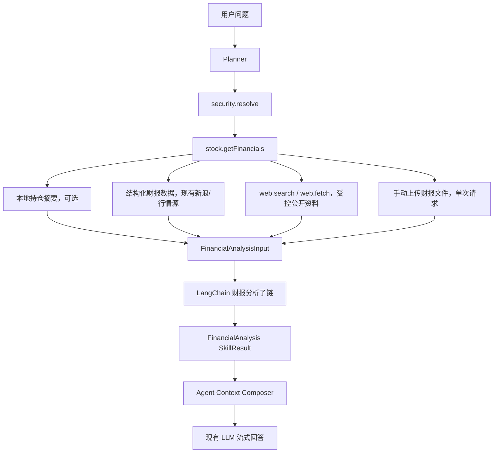

# LangChain 财报分析技术架构设计

## 1. 文档目的

本文档用于约束 LangChain 财报分析能力的技术实现，避免后续开发时把 LangChain 扩展成第二套 Agent Runtime，或把财报分析、网页抓取、持仓核算和最终回复生成混在一起。

配套需求文档见：

- [LangChain 财报分析能力需求文档](./LANGCHAIN_FINANCIAL_ANALYSIS_REQUIREMENTS.md)

## 2. 当前系统上下文

StockTracker 现有 AI 架构已经包含：

- `lib/agent/planner.ts`：将用户问题转成结构化 AgentPlan。
- `lib/agent/executor.ts`：按计划执行受控 Skill。
- `lib/agent/context.ts`：将计划和 SkillResult 组装为最小回答上下文。
- `lib/external/llmProvider.ts`：统一封装 OpenAI-compatible / Anthropic-compatible 模型调用。
- `lib/agent/skills/stock.ts`：包含 `stock.getFinancials` 等个股级 Skill。
- `app/api/ai/chat/route.ts`：负责 AI 对话流式输出、会话持久化和 Agent Trace 保存。

因此，本功能不需要重新设计 Agent 主链路。LangChain 应当嵌入现有 Skill 执行阶段，作为“财报资料到结构化财报分析”的子链。

## 3. 架构结论

推荐方案：

```text
现有 Agent Runtime 保持不变
  -> stock.getFinancials 内部调用 LangChain 财报分析子链
  -> LangChain 只返回结构化 FinancialAnalysis
  -> 最终用户回复仍由现有 Agent Context + streamChatCompletion 生成
```

不推荐方案：

```text
用户问题
  -> LangChain Agent 自己规划
  -> LangChain Agent 自己联网
  -> LangChain Agent 自己决定读持仓和交易
  -> LangChain Agent 直接生成最终回复
```

不推荐的原因：

- 会绕过现有 `allowedScopes` 权限模型。
- 会削弱 Agent Trace 对 plan、skill calls、skill results 的可解释性。
- 会让财报分析和交易写入、持仓读取、网页访问边界变模糊。
- 会让 Node 版本、依赖、模型适配和流式输出出现两套实现。

## 4. 目标模块划分

建议新增模块：

```text
lib/agent/chains/
  financialAnalysis.ts
    LangChain 财报分析子链。输入受控资料包，输出 FinancialAnalysis。

lib/agent/financials/
  sources.ts
    财报资料来源整理，可复用现有新浪财报、web.search、web.fetch 结果。

  uploads.ts
    手动上传财报文件解析。首版支持 PDF、TXT、Markdown、HTML、CSV 和 JSON。

  schema.ts
    FinancialAnalysis、FinancialAnalysisInput 等类型和运行时校验 schema。

  prompts.ts
    财报分析链专用 prompt。不要混入最终用户回复 prompt。
```

首版也可以将 `sources.ts`、`schema.ts`、`prompts.ts` 合并进 `lib/agent/chains/financialAnalysis.ts`，但如果文件超过约 250 行，应拆分。

## 5. 数据流



如果当前 Markdown 预览器不支持 Mermaid，可按下面的纯文本流程理解：

```text
用户问题
  -> Planner
  -> security.resolve
  -> stock.getFinancials
    -> 本地持仓摘要，可选
    -> 结构化财报数据，现有新浪/行情源
    -> web.search / web.fetch，受控公开资料
    -> 手动上传财报文件，单次请求
  -> FinancialAnalysisInput
  -> LangChain 财报分析子链
  -> FinancialAnalysis SkillResult
  -> Agent Context Composer
  -> 现有 LLM 流式回答
```

关键点：

- LangChain 子链的输入是已经整理过的 `FinancialAnalysisInput`。
- LangChain 子链不直接访问数据库。
- LangChain 子链不直接调用 `fetch`。
- LangChain 子链不直接写入会话表。
- LangChain 子链不直接面对 UI。
- 手动上传文件在 API 层解析为 `documents` 后进入子链，不长期保存原始文件。

## 6. 输入模型

建议内部输入结构：

```ts
export type FinancialAnalysisInput = {
  security: {
    symbol: string
    market: Market
    name?: string
    inPortfolio: boolean
    stockId?: string
  }
  localHolding?: {
    currentHolding: number
    avgCostPrice: number
    marketPrice: number | null
    marketValue: number | null
    realizedPnl: number
    unrealizedPnl: number
    totalPnl: number
    totalPnlPercent: number
    tradeCount: number
  }
  structuredFinancials?: {
    reportPeriod?: string | null
    revenue?: number | null
    revenueGrowth?: number | null
    netProfit?: number | null
    netProfitGrowth?: number | null
    eps?: number | null
    source: string
    note?: string
  }
  quote?: {
    price?: number | null
    peTtm?: number | null
    pb?: number | null
    epsTtm?: number | null
    marketCap?: number | null
    currency?: string
    source?: string
  }
  documents: Array<{
    title: string
    url?: string
    publisher?: string
    date?: string
    excerpt: string
  }>
  userQuestion: string
  language: 'zh' | 'en'
}
```

输入原则：

- 本地交易明细不直接进入 LangChain；只传与当前标的相关的摘要。
- 网页资料传摘要或截断正文，避免超长上下文。
- 上传文件同样只传解析后的受控长度文本，不传文件二进制。
- 对来源不明确的资料，`url` 可以为空，但最终 `confidence` 应降低。

## 7. 输出模型

输出结构沿用需求文档中的 `FinancialAnalysis`。实现时需要使用运行时 schema 校验，例如 Zod 或 LangChain 兼容的 structured output schema。

校验要求：

- `symbol`、`market`、`metrics`、`highlights`、`risks`、`trendSummary`、`missingData`、`sources`、`confidence` 必须存在。
- 数字字段不可由模型从无来源文本中硬编；无法确认时填 `null`。
- `sources` 中无标题的项目应丢弃。
- `sources` 为空时，`confidence` 必须强制降为 `low`。
- `portfolioImplications` 只有在 `security.inPortfolio === true` 时允许非空。

## 8. LangChain 使用范围

首版使用范围：

- Chat model wrapper。
- Prompt template。
- Structured output。
- 一次或少量重试。

首版不使用：

- LangChain Agent。
- LangGraph。
- Vector store。
- Retriever。
- LangSmith 远程追踪。
- Tool calling。
- Memory。

这样做的原因是现有系统已经有 Planner、Executor、Trace 和会话存储；重复引入这些能力会增加架构复杂度。

## 9. 模型适配

现有 AI 配置支持：

- OpenAI-compatible。
- Anthropic-compatible。

LangChain 首版建议只接 OpenAI-compatible，因为 `@langchain/openai` 对 `baseURL`、`apiKey`、`model` 的映射最直接，和当前配置兼容度最高。

如果用户配置为 Anthropic-compatible，首版可以采用两种策略：

- 策略 A：LangChain 子链暂不可用，`stock.getFinancials` 回退到现有结构化数据和网页搜索结果。
- 策略 B：不通过 LangChain，复用现有 `callJsonCompletion` 做同 schema 的结构化输出。

推荐首版采用策略 B。这样功能对 Anthropic-compatible 用户也可用，同时 LangChain 仍作为 OpenAI-compatible 路径的学习和实验入口。

## 10. 依赖版本策略

仓库目标是 Node.js 20.9+，依赖版本不能超过这一运行时约束。

实现前需要确认：

- `@langchain/openai` 版本的 `engines.node` 支持 Node 20.9+。
- `@langchain/core` / `@langchain/textsplitters` 版本的 `engines.node` 支持 Node 20.9+。
- 依赖不会引入和 Next.js 16 / React 19 明显冲突的 peer dependency。

建议在实现说明中记录类似信息：

```text
选择 @langchain/openai x.y.z、@langchain/core a.b.c 与 @langchain/textsplitters c.d.e，因为它们符合仓库 Node.js 20.9+ 目标。
```

依赖必须通过 `pnpm install <pkg> --save` 添加。

## 11. `stock.getFinancials` 改造边界

当前 `stock.getFinancials` 的职责是“获取财报关键数据，必要时建议搜索兜底”。改造后职责变为：

```text
获取财报关键数据 + 整理公开资料 + 调用财报分析子链 + 返回结构化财报分析
```

首版仍应保留：

- A 股新浪财报抓取逻辑。
- 结构化数据失败时的 `needsFollowUp` / `suggestedSkills` 机制。
- `quote.read` / `network.fetch` 权限要求。

需要新增：

- LangChain 子链调用。
- `FinancialAnalysis` 输出。
- 子链失败降级。
- 来源和缺失字段标准化。
- 手动上传文件优先作为 `documents` 输入；没有上传文件时再走公开搜索兜底。

## 12. Planner 调整

Planner 不需要知道 LangChain 的存在。它只需要继续规划 `stock.getFinancials`。

需要优化的是 `stock.getFinancials` 的描述和 Skill 文档，让 Planner 更容易在以下问题中选择它：

- 财报分析。
- 年报/季报/中报。
- 营收、利润、现金流、毛利率。
- 业绩超预期或低于预期。
- 估值是否匹配业绩。

Planner prompt 不应出现“调用 LangChain”这类实现细节。

## 13. Trace 与调试

Agent Trace 应继续记录：

- Planner 输出的 `stock.getFinancials` 调用。
- SkillResult 中的 `FinancialAnalysis`。
- 来源列表。
- 缺失字段。
- 置信度。
- 子链是否降级。

不应记录：

- API Key。
- 完整模型请求 header。
- 过长网页全文。
- 用户未明确相关的完整交易明细。

## 14. UI 放置方案

当前主导航结构是：

```text
总览
持仓
大盘指标
AI
  - AI 对话
  - 分析中心
设置
```

财报分析建议放在 **AI 一级分组下**，不新增独立一级 Tab。

推荐信息架构：

```text
AI
  - AI 对话
  - 分析中心
  - 财报分析
```

推荐路径：

```text
/ai/financials
```

理由：

- 财报分析本质是 AI 投研能力，不是持仓管理、行情大盘或系统设置。
- 新增一级 Tab 会把侧边栏变成“功能堆叠”，降低主导航稳定性。
- AI 分组已经存在，天然适合作为投研能力集合。
- 后续如果增加“公告解读”“研报问答”“复盘报告”，也可以继续放在 AI 分组下。

### 14.1 和现有页面的关系

`/ai/chat`：

- 保持通用连续问答入口。
- 用户可以自然语言询问财报。
- 适合多轮追问。

`/ai`：

- 继续作为分析中心首页。
- 增加“财报分析”入口卡片。
- 展示最近财报分析记录或推荐入口可以放到后续阶段。

`/ai/financials`：

- 新增专门页面。
- 适合明确选择标的、查看财报分析结果、展示来源和缺失字段。
- 首版可以只做一个查询表单 + 结果展示，不需要复杂仪表盘。

### 14.2 是否需要一级 Tab

暂不建议新增一级 Tab。

只有当财报分析演进为独立研究工作台，并且包含以下多项能力时，才考虑一级 Tab：

- 财报日历。
- 批量持仓财报扫描。
- 财报历史归档。
- 多公司横向对比。
- 本地研报/年报资料库。
- 指标筛选器。

在首版范围内，这些都不是必要能力。

## 15. 页面首版形态

`/ai/financials` 首版建议包含：

- 标的选择：支持从当前持仓选择，也支持输入未持仓代码/名称。
- 文件上传：支持 PDF、TXT、Markdown、HTML、CSV 和 JSON，最多 3 个文件。
- 问题输入：默认问题为“分析最新财报的亮点、风险和估值匹配度”。
- 分析按钮：触发 AI 财报分析。
- 结果区域：
  - 摘要结论。
  - 核心指标。
  - 亮点。
  - 风险。
  - 持仓影响。
  - 来源。
  - 缺失数据。
  - 置信度。

页面应避免做成营销式落地页。它是一个工作台页面，重点是选择标的、运行分析、阅读结果和追问。

## 16. 测试策略

最低测试覆盖：

- `FinancialAnalysis` schema 校验。
- LangChain 子链在 mock 输入下能返回结构化结果。
- 模型输出缺少来源时置信度会被降级。
- `stock.getFinancials` 在子链失败时能降级。
- Planner 在财报问题下仍选择 `stock.getFinancials`。

人工验证：

- A 股已持仓标的。
- 美股未持仓标的。
- 港股标的。
- AI 配置缺失。
- 网络抓取失败。
- 来源不足。

## 17. 实施顺序建议

1. 确认本文档和需求文档。
2. 选择 Node 20.9+ 兼容的 LangChain 版本。
3. 实现 `FinancialAnalysis` schema 和子链。
4. 改造 `stock.getFinancials`。
5. 调整 Skill 文档和 Planner 可见描述。
6. 增加 `/ai/financials` 页面入口和基础页面。
7. 做测试和浏览器验证。

## 18. 决策记录

- LangChain 作为财报分析子链，不替换 Agent Runtime。
- 首版不引入 LangChain Agent、LangGraph、RAG 和向量库。
- 财报分析 UI 放在 AI 一级分组下，推荐路径 `/ai/financials`。
- 首版不新增独立一级 Tab。
- Node.js 20.9+ 兼容性优先于使用更高运行时要求的 LangChain 版本。
